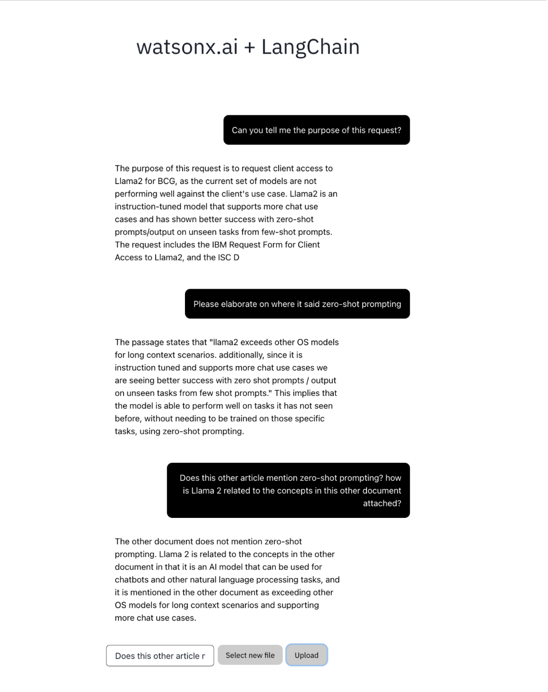

# Building Reflex Applications

Learning how to build applications with Reflex <a href="https://reflex.dev/">Reflex</a>

## See it live and in action 📺

# Startup 🚀

1. Create new environment `conda create -n reflexdev`
2. Activate the environment `conda activate reflexdev`
3. Install stuff `pip install -r requirements.txt`
4. Initialise the app by running `reflex init`
5. Update `watsonx_api_key`, `watsonx_model` and `watsonx_api_endpoint` in `rxconfig.py`
6. Run the app by running `reflex run` or `reflex run --loglevel debug` to enable debugging

# Notes

- Default front end is localhost:3000
- Default back end is localhost:8000 e.g. http://localhost:8000/ping

# Other References 🔗

-<a href="https://reflex.dev/docs/getting-started/introduction/">Reflex Introduction</a>:based on this introduction tutorial.

-<a href="https://github.com/IBM/ibm-generative-ai">IBM Generative AI</a>:providing the LLM capability.

# Who, When, Why?

👨🏾‍💻 Author: Nick Renotte  
📅 Version: 1.x 
📜 License: This project is licensed under the MIT license. Feel free to use it, just don't do bad things with it.  
